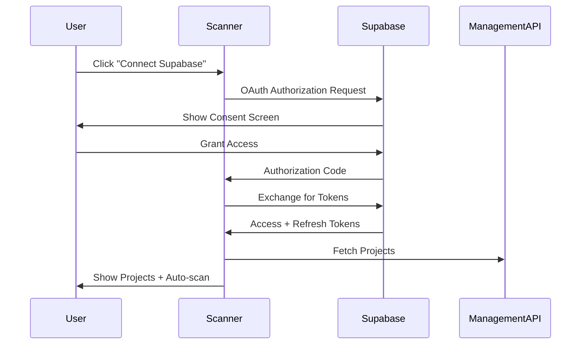

# 🔐 RLS Security Scanner

An automated security scanner for Supabase databases that detects Row Level Security (RLS) vulnerabilities and exposed data.

## ✨ Zero Setup Required!

**Connect any Supabase project via OAuth and scan immediately - no SQL scripts, no functions to install, no manual configuration!**

The scanner uses the Supabase Management API and standard PostgreSQL system tables (`information_schema`) to analyze your database. Your users just:
1. 🔗 Connect their Supabase account via OAuth
2. 📋 Select which projects to scan
3. 🚀 Click "Scan" - that's it!

## 🎯 What It Does

This tool scans your Supabase database to find:
- ❌ Tables without RLS enabled
- 🔓 Data exposed to anonymous users
- 🚨 Sensitive fields that are publicly accessible
- 📊 Real-time security reports with sample leaked data
- 🤖 **AI-Powered Analysis** using Claude to detect sensitive data and generate fix recommendations

## 🚀 Try It Live

**Use the deployed scanner instantly:**
👉 **[https://cautious-fortnight-one.vercel.app](https://cautious-fortnight-one.vercel.app)**

No installation required! Just sign in with Google and connect your Supabase account.

## 🛠️ Local Development (For Contributors)

If you want to run the scanner locally or contribute to the project:

### 1. Install Dependencies

```bash
pnpm install
```

### 2. Set Up Google Authentication (Required)

Users must sign in with Google before using the scanner.

**Quick Setup:**
1. Create a Supabase project for authentication
2. Enable Google OAuth provider
3. Add credentials to `.env.local`

**📖 Detailed Guide**: See [GOOGLE_AUTH_SETUP.md](./GOOGLE_AUTH_SETUP.md) for step-by-step instructions.

### 3. Set Up Environment Variables

Create a `.env.local` file in the root directory:

```bash
# Required: Scanner authentication (your app's Supabase project)
NEXT_PUBLIC_SUPABASE_URL=https://your-project.supabase.co
NEXT_PUBLIC_SUPABASE_ANON_KEY=your-anon-key
SUPABASE_SERVICE_ROLE_KEY=your-service-role-key

# Required: Supabase OAuth Integration
SUPABASE_OAUTH_CLIENT_ID=your-oauth-client-id
SUPABASE_OAUTH_CLIENT_SECRET=your-oauth-client-secret
ENCRYPTION_KEY=your-32-byte-hex-key

# Optional: AI-powered analysis
ANTHROPIC_API_KEY=sk-ant-your-key-here
```

**Get your OAuth credentials:**
1. Go to [Supabase Dashboard](https://supabase.com/dashboard) → Your Organization Settings
2. Navigate to **OAuth Apps** tab
3. Click **Add application**
4. Fill in:
   - **Name**: RLS Security Scanner
   - **Redirect URI**: `http://localhost:3000/api/auth/supabase/callback` (for dev) or your production URL
   - **Scopes**: Select "all" (full Management API access)
5. Copy the `client_id` and `client_secret` to your `.env.local`

**Generate encryption key:**
```bash
openssl rand -hex 32
```

**Get Anthropic API key** from: https://console.anthropic.com/

**Without the API key**: The scanner will still work with basic rule-based detection.  
**With the API key**: You get AI-powered insights including:
- 🤖 Intelligent risk assessment
- 🔍 Automatic sensitive data detection (PII, credentials, etc.)
- ✅ Custom security recommendations
- 🔧 Auto-generated SQL fix scripts

### 4. Run the Development Server

```bash
pnpm dev
```

Open [http://localhost:3000](http://localhost:3000) and sign in with Google.

### 5. Connect Your Supabase Account

After signing in with Google:

1. Click **"Connect Supabase"** on the homepage
2. Authorize the RLS Scanner to access your Supabase account
3. Your projects will be automatically fetched and scanned
4. View scan results directly on the homepage
5. Click **"Re-scan"** on any project to run a new analysis

**That's it!** No manual key entry required. The scanner uses OAuth to securely access your projects through the Supabase Management API.

## 📋 Test Database Setup

Create a vulnerable test table to see the scanner in action:

```sql
-- In Supabase SQL Editor
create table public.user_secrets (
  id uuid primary key default gen_random_uuid(),
  user_id uuid,
  secret_data text,
  created_at timestamptz default now()
);

-- Insert test data
insert into public.user_secrets (user_id, secret_data)
values 
  (gen_random_uuid(), 'My credit card is 1234-5678-9012-3456'),
  (gen_random_uuid(), 'My password is SuperSecret123!');

-- DON'T enable RLS (this makes it vulnerable for testing!)
```

The scanner will detect this vulnerability and show you the exposed data.

## 🔐 OAuth Integration

The RLS Scanner uses Supabase OAuth 2.0 to securely connect to your Supabase account.

### How It Works



### Security Features

- 🔒 **Token Encryption**: OAuth tokens are encrypted with AES-256-GCM before storage
- 🔑 **PKCE Flow**: Uses Proof Key for Code Exchange for enhanced security
- 🎯 **Automatic Refresh**: Tokens are automatically refreshed before expiration
- 🔐 **RLS Policies**: Row Level Security ensures users only see their own data
- ⏱️ **Revocable Access**: Users can disconnect at any time from Supabase settings

### What Gets Scanned

When you connect your Supabase account:
1. ✅ All your Supabase projects are automatically discovered
2. ✅ Each project is scanned for RLS vulnerabilities
3. ✅ Scan results are stored in your scanner database
4. ✅ You can re-scan any project anytime with one click

### Benefits

- ✅ No manual key management
- ✅ Scan all projects at once
- ✅ Automatic permission scoping
- ✅ Revocable access from Supabase dashboard
- ✅ Better security (no service_role key exposure)
- ✅ Automatic scans on new projects

## 🔧 Tech Stack

- **Next.js 16** - React framework with App Router
- **TypeScript** - Type safety
- **Supabase JS** - Database client
- **Tailwind CSS** - Styling
- **shadcn/ui** - UI components (future)

## 📝 How It Works

1. **Discovery Phase**: Queries PostgreSQL catalog to find all public tables
2. **Testing Phase**: Tests each table with anonymous client
3. **AI Analysis Phase** (if API key provided): Claude analyzes leaked data to:
   - Detect sensitive data types (PII, credentials, financial info)
   - Assess security risk and impact
   - Generate custom remediation recommendations
   - Create auto-fix SQL scripts
4. **Reporting Phase**: Generates detailed security report with:
   - Severity levels (Critical, High, Medium)
   - Exposed fields and sample data
   - AI-powered insights and recommendations
   - Copy-paste SQL fixes

## 🤖 AI-Powered Features

When you add an Anthropic API key, the scanner gains superpowers:

### Intelligent Risk Assessment
Claude analyzes the actual data content and provides context-aware risk explanations, not just "RLS is disabled".

### Sensitive Data Detection
Automatically identifies:
- Personal Identifiable Information (PII)
- Financial data (credit cards, bank info)
- Authentication credentials (passwords, API keys, tokens)
- Healthcare information
- Proprietary business data

### Custom Recommendations
AI generates specific, actionable steps tailored to your exact table structure and data.

### Auto-Fix SQL Scripts
Get copy-paste ready SQL that:
- Enables RLS on the table
- Creates appropriate policies based on your schema
- Includes comments explaining each step

### Example AI Output
```
🤖 Risk Assessment:
"This table contains unencrypted passwords and credit card information 
accessible to anyone on the internet. This represents a critical data 
breach risk with potential regulatory implications (GDPR, PCI-DSS)."

🔓 Sensitive Data: PII, Passwords, Financial Data
✅ Recommendations:
  1. Enable RLS immediately on user_secrets table
  2. Create policy restricting access to authenticated users only
  3. Consider encrypting sensitive fields at application level
  4. Audit existing data access logs for potential breach
```

## 🛡️ Security Notes

- ⚠️ **Never commit secrets** to version control (`.env.local` is gitignored)
- 🔒 **OAuth tokens** are encrypted with AES-256-GCM before database storage
- 🔑 **Encryption key** must be 32 bytes (64 hex characters)
- 🎯 Only scan databases you own or have permission to test
- 📊 This tool is for security testing and education
- 🤖 AI analysis happens server-side - your data is sent to Anthropic for analysis
- 🔐 **Revoke access** anytime from your Supabase organization OAuth settings

## 🤝 Contributing

Issues and PRs welcome! This is an open-source security tool for the Supabase community.

## 📄 License

MIT License - feel free to use and modify!
